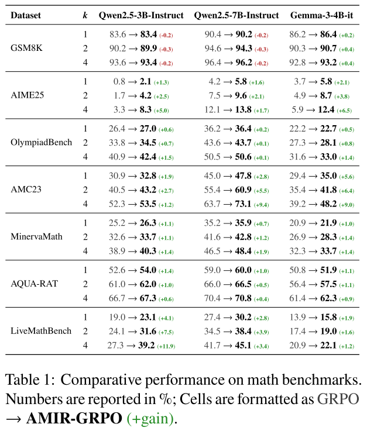
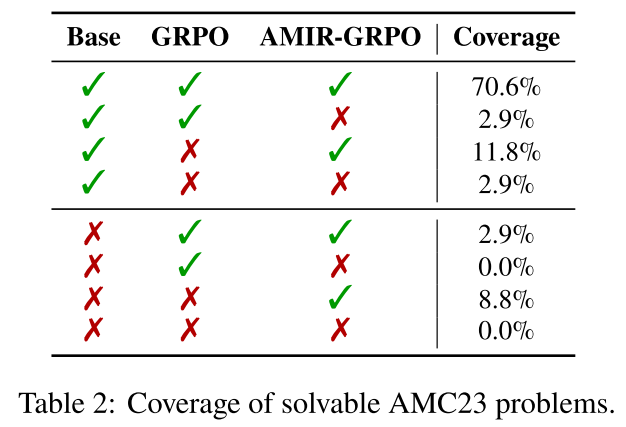
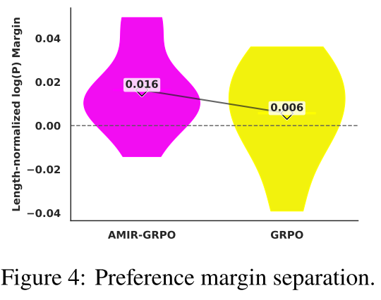

<div align="center">

# AMIR-GRPO: Inducing Implicit Preference Signals into GRPO

<p>
  <a href="https://amirhosseinyari2002.github.io/"><b>Amir Hossein Yari</b></a>
  ,
  <a href="https://www.fajrikoto.com/home"><b>Fajri Koto</b></a>
</p>

</div>

---

## 🌟 What is AMIR-GRPO?

AMIR-GRPO extends GRPO with an implicit DPO-style contrastive regularizer derived directly from intra-rollout reward rankings, requiring no additional annotations.

## 📈 Key Results & Impact

✅ **Richer supervision:** turns each rollout group into many preference constraints rather than a handful of scalar advantages.<br>
✅ **Sharper decision boundary:** explicitly contrasts high- vs. low-reward completions, strengthening suppression of poor trajectories and and producing a cleaner separation between correct and incorrect reasoning.<br>
✅ **Mitigate length bias:** addresses GRPO’s intrinsic length bias by preventing penalty dilution across long, low-reward trajectories.<br>
✅ **Broader gains:** improves coverage and generalization on mathematical reasoning benchmarks beyond instances solved by standard GRPO.<br>
✅ **Cross-variant compatibility:** integrates seamlessly with GRPO-family variants (e.g., GSPO) and yields consistent benchmark gains.<br>

<table>
  <tr>
    <td valign="top" align="center" style="padding-right:1px;">
      
    </td>
    <td valign="top" align="center">
      
      <br/>
      
    </td>
  </tr>
</table>


---

## 🛠️ Installation

```bash
# Clone the repository
git clone https://github.com/AmirHosseinYari2002/AMIR-GRPO.git
cd AMIR-GRPO

# Install necessary libraries
pip install -U pip
pip install -r requirements.txt
````

---

## 🏋️ Training

Training is launched via `python -m Train.train` and the CLI mirrors the full configuration.

```bash
python -m Train.train \
  --model_name google/gemma-3-4b-it \
  --lora_rank 16 \
  --max_seq_length 2048 \
  --load_in_4bit 0 \
  --model_dir trained_model_directory \
  --dataset_name gsm8k \
  --dataset_split train \
  --trainer_type amir_grpo \
  --calibration \
  --learning_rate 5e-6 \
  --weight_decay 0.1 \
  --max_grad_norm 0.1 \
  --per_device_train_batch_size 1 \
  --gradient_accumulation_steps 4 \
  --max_steps 1000 \
  --seed 0 \
  --lr_scheduler_type cosine \
  --warmup_ratio 0.1 \
  --optim adamw_8bit \
  --adam_beta1 0.9 \
  --adam_beta2 0.99 \
  --num_generations 8 \
  --max_prompt_length 1024 \
  --max_completion_length 1024 \
  --loss_type grpo \
  --epsilon 0.20 \
  --epsilon_high 0.20 \
  --mask_truncated_completions 0 \
  --scale_rewards group \
  --importance_sampling_level token \
  --lambda_reg 0.01 \
  --reward_margin 2.0 \
  --beta_dpo 0.2 \
  --pair_mining all \
  --max_pairs_per_group None \
  --ref_free true \
  --logging_steps 1 \
  --save_steps 50 \
  --report_to wandb \
  --wandb_api_key your_wandb_api_key

```

---

## 🔬 Evaluation

Evaluate the performance of the trained model using the Eval.eval script.

```bash
python -m Eval.eval \
  --dataset_name olympiadbench \
  --model_dir trained_model_directory
```

---


## 📝 Citation
